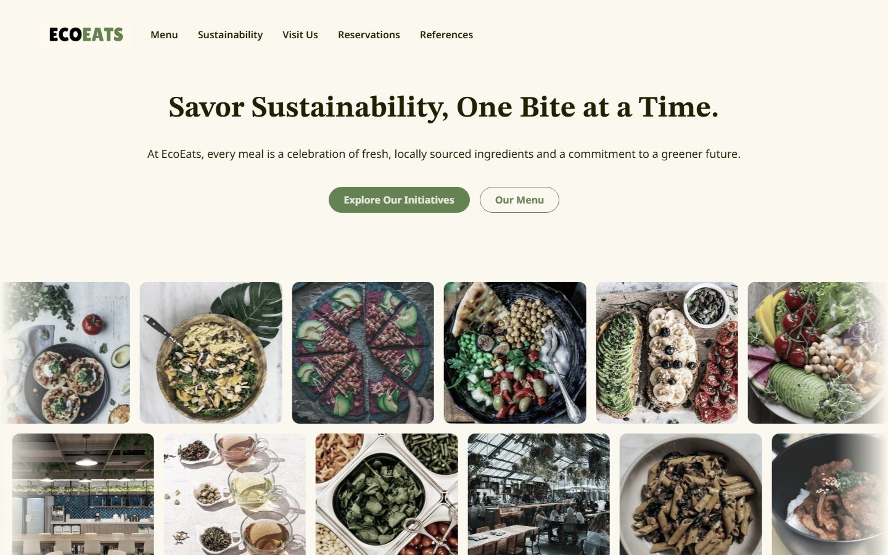
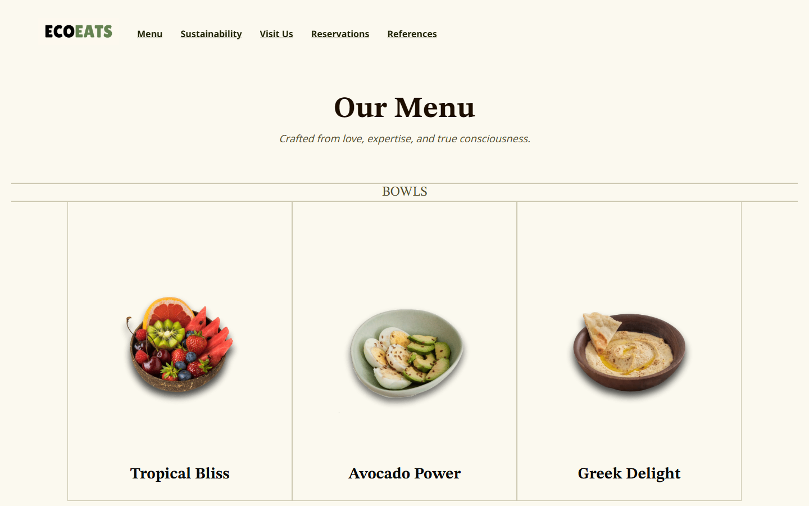
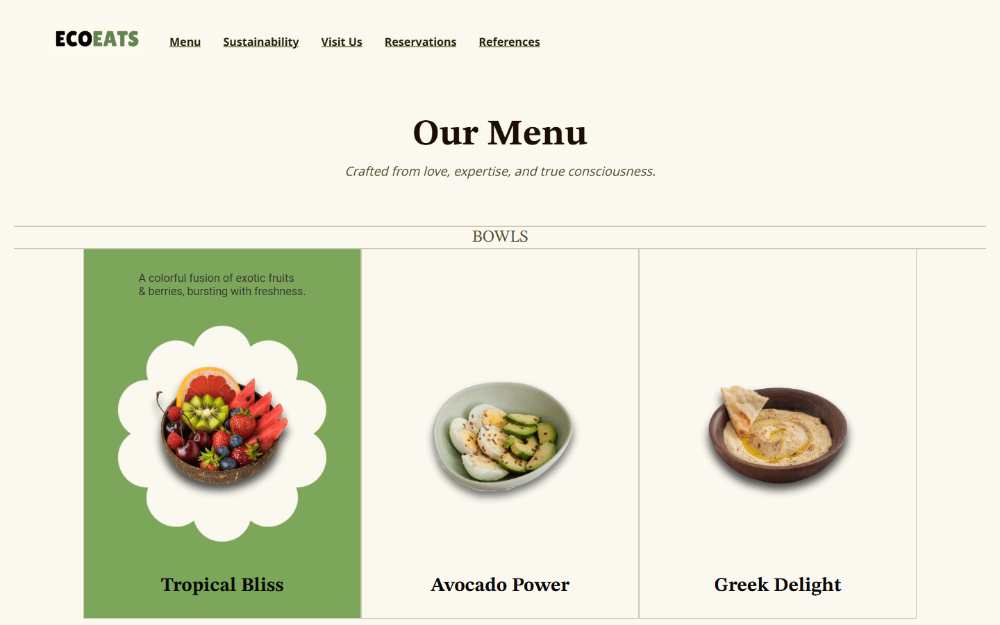

# EcoEats 🌱

A website for a restaurant that doesn't exist (yet). The idea: a place where every meal is a little greener, and the website should feel like that too. Warm, leafy, and calm instead of the usual loud food-delivery look.

**It's live here → [eco-eats-tau.vercel.app](https://eco-eats-tau.vercel.app)**

## The home page



That headline was the whole starting point. Underneath it there are two rows of food photos that slide sideways forever, one row going each way. They're muted by default so the type stays readable, and when you point at one it lifts and the color comes back. I probably spent way too long getting the fade on the edges right so tiles don't just pop out of nowhere.

## The menu



Bowls, plates, and smoothies. Looks pretty plain sitting there, right?

**Now hover over one of the cards:**



The whole card fills green, a white flower shape blooms out from behind the bowl, and the description slides up line by line with each line a beat behind the last one. This is my favorite thing on the entire site. Every card has a slightly different shape behind it too, so it's not the same trick three times.

## Other little things I'm proud of

- **Click a tab in the "what we do" section on the home page** and the photo doesn't cross-fade like everything on the internet does. Instead a dark green panel sweeps across, and the new photo is already sitting there when it clears.
- **Also on that click:** a handful of little leaves get flicked out from wherever your cursor was. Green, yellow, and brown, and they actually fall with gravity instead of just floating away. Nobody asked for this. It's there anyway.
- **The reservations page** has a real calendar you can pick a date and time on, and it tells you you're all set at the end.
- The home page animations check whether you've got "reduce motion" turned on in your system settings, and go still if you have.

## The pages

| Page | What's on it |
| --- | --- |
| Home | The headline, the sliding photo rows, the tabs, testimonials |
| Menu | Bowls, plates, smoothies, and the hover cards |
| Sustainability | Farm-to-table, and the orgs we took inspiration from |
| Visit Us | Contact info and hours |
| Reservations | Pick a date and time |
| References | Worklog, research citations, image citations |

## How it's built

Plain HTML and CSS, with a bit of JavaScript for the animations. No frameworks, no build step, nothing to install. If you want to poke at it, download it and open `index.html` in your browser. That's genuinely it.

```
index.html, menu.html, ...   the pages
index.css                    styles shared by every page
polish.css / polish.js       the home page animations
images/                      every photo and icon
docs/                        image citations PDF
```

## Credits

Built by me, with [Ayush](https://github.com/AyushP-17), Pranai, and Bhavish. Every photo we used is credited in `docs/` and on the References page, because none of it is ours and we tried to be careful about that.
